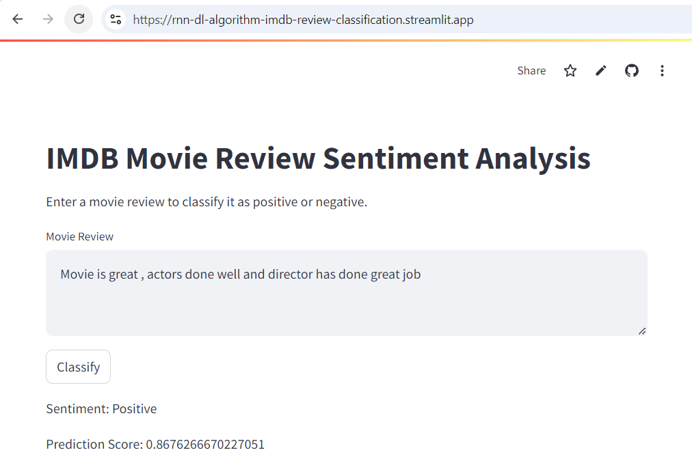
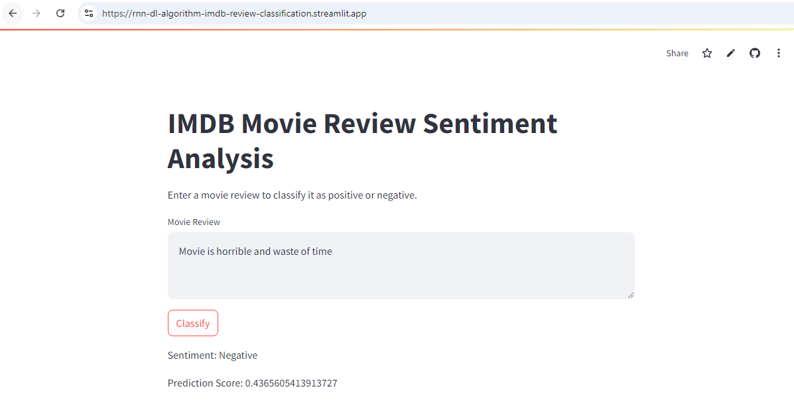

# RNN-DL-Algorithm
Project: Performing sentiment analysis on IMDB reviews dataset with Simple-RNN and deploying as streamlit app in streamlit community cloud
Implemented:
1. Word Embeddings
2. Trained Simple RNN
3. Developed and deployed streamlit apps

Example for Positive

Example for Negative

